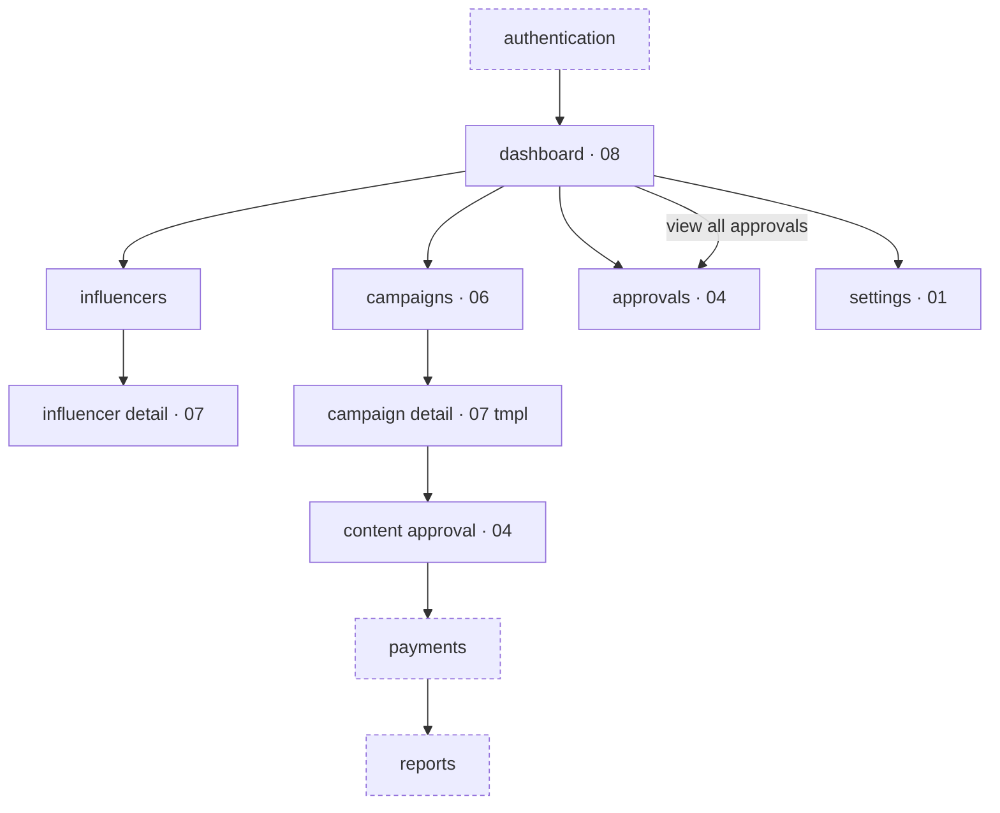
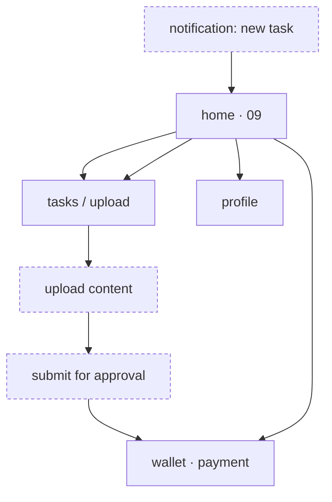

# Navigation Relationships — TEAR V2 Stitch Export

Sources of truth: the nav/sidebar/tab-bar **link labels** inside each `code.html`, the **active-state**
marker (`text-primary border-b-2 border-primary`) that tells which sidebar section a screen represents,
and the **journey/architecture text** in the three UX Blueprint screens (02, 03, 05).

> **Important caveat:** every navigation `<a>` in every screen uses `href="#"`. There are **no real
> inter-screen hrefs** in the export. So "screen X links to screen Y" is inferred from (a) a nav **label**
> that names a section, plus (b) which screen carries that section's **active state**, or (c) an explicit
> statement in a blueprint. Below, edges are tagged **(link)** when grounded in a real nav label present in
> the markup, and **(blueprint)** when derived from a blueprint diagram/breadcrumb. Nothing is invented.

---

## 1. Admin experience

### Root / app shell
**Root = Admin App Shell**, canonically the Admin Dashboard (`08`), whose sidebar `active` item is
**dashboard**. The fixed left drawer (`w-64`) is the persistent admin navigation and is byte-identical
across screens 01/04/06/07/08 (and, oddly, 09).

### Sidebar (the admin nav menu) — labels present in markup
`dashboard` · `influencers` · `campaigns` · `approvals` · `settings`  (all `href="#"`).

### Which screen is which sidebar section (from active-state marker)
| Sidebar item | Screen carrying its active state | Template |
|---|---|---|
| dashboard | `08` admin dashboard | dashboard grid |
| influencers | `07` form & detail (influencer profile) | master-detail |
| campaigns | `06` universal list (campaigns) | list |
| approvals | `04` approval & timeline | timeline+approval |
| settings | `01` profile & component lab | profile/settings |

### Parent / child relationships
- **Shell → sidebar sections** (link): dashboard(08), influencers, campaigns(06), approvals(04), settings(01).
- **List → detail** (blueprint + link): the campaigns list (`06`) rows are `cursor-pointer group` and the
  admin journey (05) states `campaigns → detail view`; the detail view is the master-detail template (`07`).
  Blueprint 03's "universal list & bulk actions" reinforces list rows resolving to entity detail.
- **Detail → content approval** (blueprint): journey flow `detail view → content approval`; the approval UI
  is screen `04`.
- **Dashboard → approvals** (link): screen `08` has a "pending approvals" table with a
  `view all approvals` anchor and a sidebar `approvals` item → screen `04`.
- **Dashboard quick actions** (link labels, href="#"): `onboard influencer`, `draft campaign`,
  `process payments` — action shortcuts, no target screen exported.
- **Approval → payments → reports** (blueprint only): tail of the admin journey flow (05); no payments or
  reports *screen* exists in the export (documented, not built).

### Breadcrumb hierarchy (blueprint 03)
`admin / campaigns / fall 24 / briefing` — confirms depth: **admin > campaigns > [campaign] > briefing**.

### Admin journey flow (blueprint 05, section "1. the journey flow")
`authentication → dashboard → campaigns → detail view → content approval → payments → reports`.

Solid nodes/edges = grounded in a real sidebar/label or active-state (**link**). Dashed nodes
(`authentication`, `payments`, `reports`) exist only in the blueprint (**blueprint**); the
`Camp → CampDet → Approve` chain is **blueprint** (journey flow), the sidebar fan-out is **link**.

---

## 2. Influencer experience

### Root / app shell
**Root = Influencer Mobile Portal Shell**, canonically the Influencer Dashboard (`09`). Real navigation is
the **bottom tab bar** (the desktop drawer on 09 is hidden on mobile and mislists admin routes — see anomaly).

### Bottom tab bar (the influencer nav) — labels present in markup
`home` · `tasks` · `wallet` · `profile`  (icons `home`, `assignment_late`, `payments`, `person`; all `href="#"`).
The active tab on `09` is **home**.

### Parent / child relationships
- **Portal shell → tabs** (link): home(09 dashboard), tasks, wallet, profile.
- **home → submit content / upload** (link + blueprint): the `09` hero CTA is "submit content / upload drafts",
  and blueprint 02's core loop shows `home/notification → upload content`. The `tasks` tab (`assignment_late`)
  is the task/upload destination.
- **tasks → upload → submit for approval** (blueprint 02): phone mockups Notification → Upload Content
  ("submit for approval") is the influencer happy path.
- **approval → wallet / payment** (blueprint 02): final mockup is Wallet ("available balance",
  "payment confirmed"), i.e. approved work resolves into the `wallet` tab.
- **profile tab** (link): influencer's own profile (the profile template, cf. screen 01/07 profile body).

### Influencer core loop (blueprint 02, section "01. core loop")
`notification: new task assigned → upload content (submit for approval) → wallet (payment confirmed)`.

Solid = grounded in the bottom-tab labels present in markup (**link**: home/tasks/wallet/profile).
Dashed = steps described only in blueprint 02's mockups (**blueprint**: notification, upload, submit-for-approval).

---

## 3. Cross-experience notes & anomalies

- **All `href="#"`** — the export has no functional routing; every relationship above is inferred from
  labels, active states, or blueprint text, never from a real link target.
- **Bottom-nav swap:** admin content screens `01/04/06/07` embed the *influencer* tab bar
  (home/tasks/wallet/profile) on mobile, while the true admin dashboard `08` uses an *admin* tab bar
  (dash/creators/campaigns/settings). Treat the influencer tab bar on those admin screens as a template
  artifact, not an intended admin route.
- **Influencer portal desktop drawer (09)** lists the **admin** 5 items (dashboard/influencers/campaigns/
  approvals/settings) — inconsistent with the influencer tab bar; the tab bar is the authoritative
  influencer nav.
- **Documented-but-unbuilt screens:** `payments` and `reports` (admin journey) and the influencer
  `tasks/upload` and `wallet` details appear only inside blueprints (02/05) — no standalone `code.html`
  exists for them.
- **Two navigation roots:** Admin App Shell (root = dashboard `08`) and Influencer Mobile Portal (root =
  home `09`). They share design tokens but not navigation.
